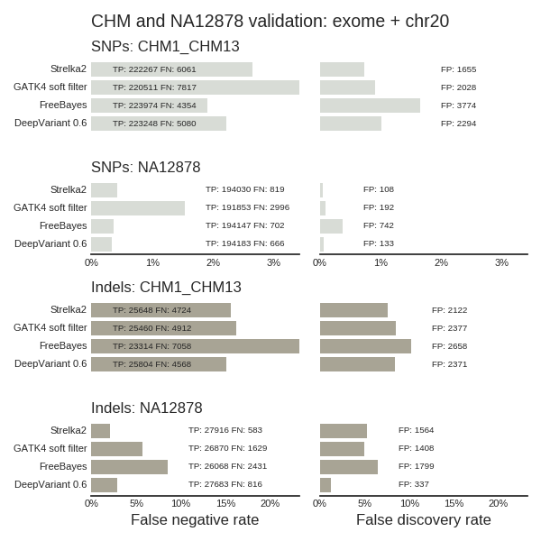
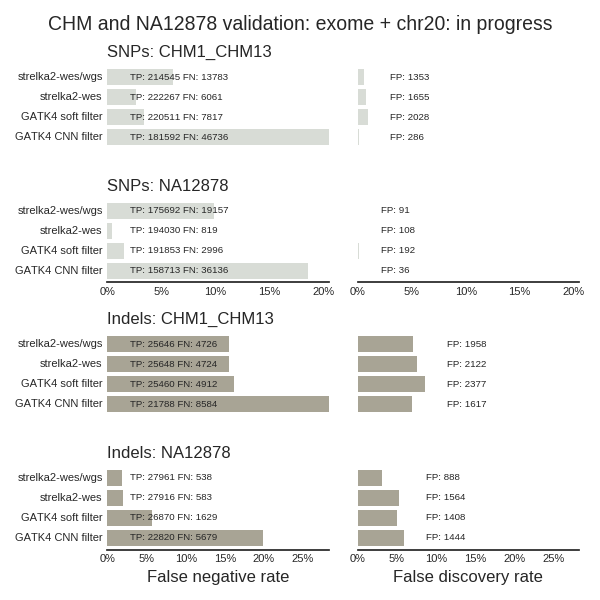

# DeepVariant validations

Validations of [DeepVariant](https://github.com/google/deepvariant) with Genome
in a Bottle and [the CHM based synthetic diploid truthset](https://gatkforums.broadinstitute.org/gatk/discussion/10912/what-is-truth-or-how-an-accident-of-nature-can-illuminate-our-path).

- [Description of inputs and running](https://github.com/bcbio/bcbio_validation_workflows#synthetic-diploid-chm-and-genome-in-a-bottle)
- [CWL workflow](https://github.com/bcbio/bcbio_validation_workflows/tree/master/giab-chm)

## CHM and NA12878 from Genome in a Bottle

The CHM dataset with filtering for problematic indels (1bp and >50bp) looks
reasonably comparable to NA12878. It has ~2x more false negatives for SNPs and
~4x more false negatives for indels, so either has potential noise or is
identifying regions that Illumina based callers fail to identify.
DeepVariant has improved sensitivity on SNPs for both NA12878 and CHM,
indicating that training on Genome in a Bottle inputs does not bias towards
those samples.

Versions:
- hg38 genome build
- GATK4.0b6
- FreeBayes 1.1.0.46
- strelka 2.8.4
- DeepVariant 0.4.1

### Resources

- [NA12878 false positives for GATK4 and DeepVariant](https://s3.amazonaws.com/chapmanb/validation/giab-chm/NA12878-gatk4-dp-fps.tar.gz) 

## Revised CHM and NA12878 with improved prep

Mark Depristo from the Google DeepVariant team and Sangtae Kim from the Illumina
Strelka2 team both pointed out a potential issue with the prepared BAM files in
exome and chr20 regions that might introduce additional bias. These are prepared
by subsets of whole genome BAM files to read pairs mapping in exome regions,
which introduces unexpected bias in strandedness and mate placement for
remaining reads. To avoid this we re-prepared the BAMs keeping any read pairs
where either end maps in exome (or chr20 regions) and then variant calling only
in exome regions.

Comparing and contrasting the two BAM preparation methods:

We see:

- Better NA12878 SNP sensitivity and specificity in the improved BAM
  preparation method.
- Some improvement in NA12878 indel sensitivity and specificity, but not as
  much as the indel improvement.
- Very little change in CHM for specificity, but some improvement in
  sensitivity, especially for SNPs.

This indicates that both machine learning based methods like DeepVariant and
filter based methods like HaplotypeCaller, Stelka2 and FreeBayes pick up on
Illumina specific features in the Genome in a Bottle truth sets. This is
especially relevant for SNP calling. Since the PacBio only CHM dataset
does not show the same improvements, we're removing an interdependence
between Illumina inputs and evaluations or introducing errors
resilient to current metrics used for filtering.

Versions as above with an update to GATK4 release:
- GATK 4.0.1.0

## DeepVariant v0.6 release, Strelka2 stratification and initial GATK CNN

Based on discussions and improvements from multiple groups after the initial
round of validations, we re-ran with:

- A new CHM truth set (0.5) from Heng Li, including 1bp and longer indels and
  cleaned up representation for direct usage with rtg vcfeval

- DeepVariant release v0.6, providing improved calling across multiple input data
  types by incorporating truth sets from PCR-free, PCR+ and exome data into the
  training. Since our truth sets are combination of chr20 and exome regions, we
  also stratify calls with the proper model (wgs or wes, respectively) depending
  on the regions being analyzed.

- For Strelka2 calls, we also apply the proper model per region: --targeted for
  exome regions and no flags for chr20. Thanks to Sangtae Kim for pointing out
  this need based on these truth sets.

- An initial evaluation of
  [GATK's CNN deep learning filter](https://gatkforums.broadinstitute.org/gatk/discussion/10996/deep-learning-in-gatk4)
  as incorporated into GATK 4.0.3.0. This is a first pass attempt that uses
  HapMap SNPs and Mills indels to filter by 2D CNN scores with
  `FilterVariantTranches` at a 99% tranche. This will need additional
  configuration but the goal was to provide a baseline for improvement and a
  full workflow using this approach. Using the 2D classifier with reads
  currently takes ~5 hours to filter, so we'll be trying to improve runtimes for
  iterating over multiple selection tuning attempts.

The comparison demonstrates the tool improvements compared with the previous
round of analysis:

- The updated CHM 0.5 benchmark has better indel resolution and compares
  similarly to our previous hand-prepared version, so will be an increasingly
  useful truth set for future comparisons.
- DeepVariant 0.6 has improved indel sensitivity and specificity compared to the
  previous validation, especially on the Genome in a Bottle PCR+ sample.
- The GATK 4.0.3.0 soft filtered calls are less sensitive than the previous
  comparison (4.0.1.0). We need to explore why these changed; both used
  HaplotypeCallerSpark for parallelization which the GATK team is actively
  developing and is in beta.

The GATK CNN filtering and mixed Strelka2 modeling are still works in progress.
The CNN filter we used with a 99% tranche cutoff is too stringent and provides
greatly improved specificity at the cost of too much sensitivity. The Strelka2
WGS/WES dual model helps moderately with indels but causes a large loss in
precision for SNPs. We'll continue to work to tune these:

For anyone interested in digging more into these comparisons:

- [The GATK4 CNN, DeepVariant and strelka2 calls for this comparison](https://s3.amazonaws.com/bcbio/validation/bcbio_validate_gatk4_cnn_dv.tar.gz)
