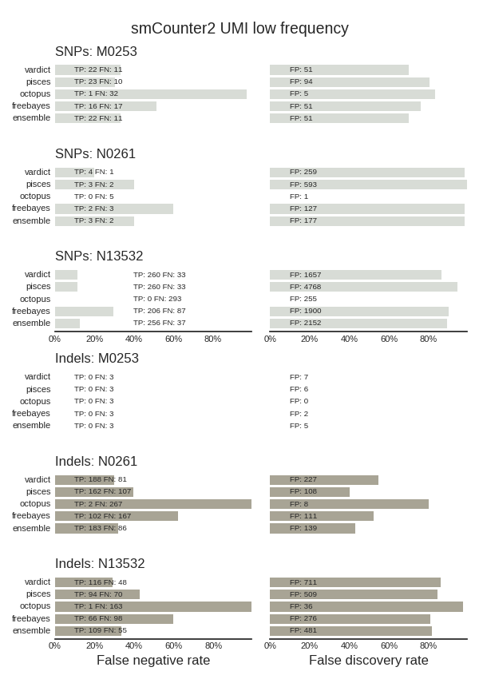
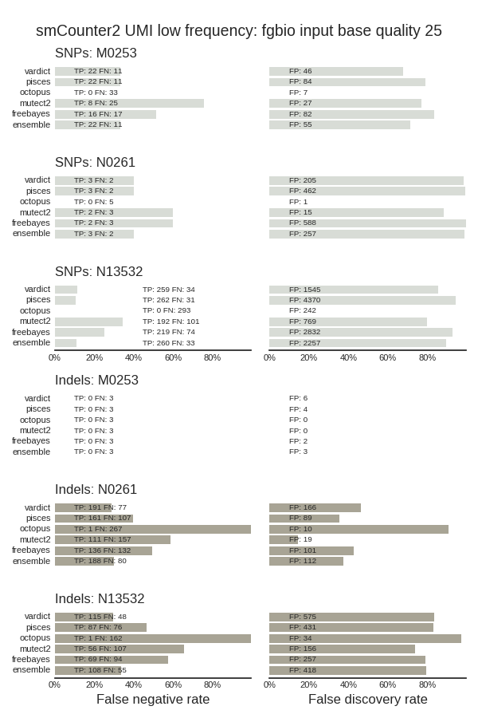

# Low Frequency Somatic calling

Cancer variant calling of low frequency somatic mutations.

## FFPE and tumor-only samples

Uses [truth sets from the Pisces tumor-only variant
caller](https://github.com/bcbio/bcbio_validation_workflows#somatic-low-frequency-variants).

The RAS validation summarizes results from 319 FFPE tumor-only samples, each
containing 1 or 2 validated SNPs in KRAS/NRAS. In the validation we ignored
ploidy calls to provide just detection capabilities of each caller.

- These results are similar to those reported in the Pisces paper, although
  VarDict has better specificity than Pisces, likely due to [additional
  filters in bcbio](http://bcb.io/2016/04/04/vardict-filtering/).
- Pisces variant calling used only the caller (not paired end stitching and
  recalibration).
- VarDict results are similar to Pisces, with slightly less sensitivity and
  slightly better specificity.
- FreeBayes had the most sensitivity but worst precision.

The Titration dataset used NA12878 specific mutations (compared with NA12877)
and compares dilutions of NA12878 in NA12877 (lower frequency mutations; less
NA12878) and dilutions of NA12877 in NA12878 (higher frequency; more NA12878):

- These results don't compare with the paper, where the Pisces team reports
  summarized 99% sensitivity for Pisces and 97% sensitivity for VarDict on SNPs
  ([Table 1](https://www.biorxiv.org/content/biorxiv/early/2018/03/29/291641.full.pdf)).
  Our stratified results are much lower, especially for the lower frequency
  NA12878 mixtures, where we only see 50% or worse sensitivity across the
  callers.
- Pisces has some nice SNP sensitivity improvements over VarDict (and somewhat
  FreeBayes), especially on the NA12878 12 percent sample.
- Pisces, FreeBayes and VarDict have similar sensitivities, although all have
  low sensitivity relative to the Pisces paper reports in Table 1.

Versions:
- GRCh37 genome build
- minimap2 2.10
- pisces 5.2.7.47
- vardict-java 1.5.1
- freebayes 1.1.0.46
- octopus 0.4.1a
- MuTect2 4.0.6.0

## Low frequency UMI-tagged tumor only samples

Using [truth sets from the smcounter2 low frequency UMI based variant
caller
paper](https://github.com/bcbio/bcbio_validation_workflows#somatic-low-frequency-variants),
we looked at the ability of callers to pick up primarily ~0.5% variants in
deeply sequenced, tumor-only samples tagged with UMIs. We called UMI consensus
reads after mapping with
[fgbio](http://fulcrumgenomics.github.io/fgbio/tools/latest/) and then used
consensus reads for calling with multiple callers. We include 4 callers and an
ensemble method that reports variants present in at least 2 callers.

All of the callers have room for improvement in both sensitivity and
specificity. Using an ensemble method indicates that we're consistently calling
similar variants, both for true and false positives. Ensemble approaches
currently don't give us a lot of extra sensitivity and specificity. The callers
have similar blind spots and extra non-somatic calls, and we'll work to
categorize those and see how we can improve generally within bcbio for these
difficult cases.

Pisces required [parameter adjustments](https://github.com/bcbio/bcbio-nextgen/commit/49d0cbb1f6dcbea629c63749e2f9813bd06dcee3) for detection at <1% frequency, thanks to [helpful suggestions from Tamsen Dunn](https://github.com/Illumina/Pisces/issues/14#issuecomment-399756862).

FreeBayes also required changes to call somatic variants at this low frequency.
We needed to [call with high ploidy](https://github.com/ekg/freebayes/issues/272#issuecomment-210982788),
[control memory usage by limiting alleles examming](https://github.com/ekg/freebayes/issues/465)
and then resolve the high ploidy calls back to a diploid representation.

For Octopus we sill need to do additional tweaking for low frequency tumor only calling.
For example: N13532 has 0.5% with 293 SNPs and 164 indels. Octopus only calls 1
passing indel but does have 40 additional calls that are filtered, primarily
because of the FRF filter, which measures the number of reads removed for
calling. So we'd need to tweak in terms of both detecting and sensitivity and
will follow up and work to improve.

## Tweaking fgbio UMI consensus settings

For UMI tagged inputs, a key step is collapsing the initial reads by UMI and
duplication status into consensus called input reads. The
[fgbio](https://github.com/fulcrumgenomics/fgbio) toolkit has highly
configurable approaches to do this and we're exploring how tweaking parameters
can help with improving sensitivity and specificity.

The coverage for the default bcbio fgbio settings are:

### min-reads 2

The biggest improvement, in both quality and speed, comes from setting
`--min-reads 2`. As described in the [fgbio CallMolecularConsensusReads documentation](https://fulcrumgenomics.github.io/fgbio/tools/latest/CallMolecularConsensusReads.html)
this parameter is suitable for deeper sequenced samples. It forces
error correction on all bases since we require at least 2 reads to call a base.
It also helps with running time since all singletons can be immediately
discarded during processing.

The summary shows the reduction in overall coverage by removing noisier
singleton reads from the consensus:

### min-base-quality 40

Using `--min-base-quality 40`:

### smcounter2 defaults

Using the smcounter2 paper defaults, `--min-reads 2 --min-input-base-quality 25
--min-base-error-rate 0.2 --min-base-quality 13`

This provides an improvement in specificity at the cost of some specificity, but
does not match the specificity differences seen in the smcounter2 paper. We'll
continue to explore more to help supplement variant calling improvements with
UMI handling.

### fgbio parameters

CallMolecularConsensusReads

| param | default | bcbio | smcounter2 |
| --- | --- | --- | --- |
| --min-reads | required | 1 | 2  |
| --min-input-base-quality | 10 | 2 | 25 |

FilterConsensusReads

| param | default | bcbio | smcounter2 |
| --- | --- | --- | --- |
| --min-reads | required | 1 | 2 |
| --max-base-error-rate | 0.1  | 0.1  | 0.2 |
| --min-base-quality | required | 13 | 0|
