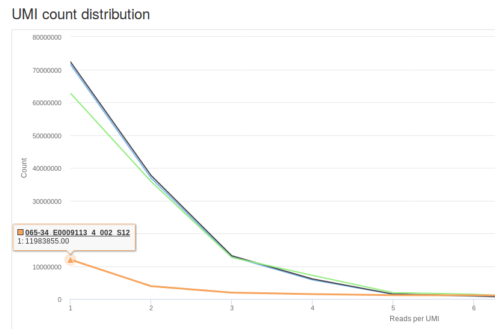

## fgbio parameter improvements for noisy samples

The goals of this comparison is to reducing low frequency noise in highly
sequenced UMI barcoded data by tweaking
[fgbio](https://github.com/fulcrumgenomics/fgbio) UMI handling.

### Standard bcbio fgbio parameters

We used 4 samples: 3 had a large number of variant calls and 1 had a lower
number of calls. All 4 are a deeply sequenced panel with the similar number of
inputs reads (~200M). The difference between the samples is in the percentage of
duplicates, the 3 noisier samples had 52-57% duplicates while the 4th has 89% duplicates:


This reflects either more signal or noise in the 3 problematic samples, either
resulting in more diversity in the input.

The lower duplication rates directly translates into coverage, resulting in >4000x
for the 3 less duplicated samples and 686x for the more duplicated sample:


Stratifying the variant calls in each of the 4 samples by frequency, the primary
difference in variants between the 4 samples is in very low frequency calls with
an allele fraction <0.1%. The 3 noisier samples have ~200k calls at this
frequency, versus only a handful for the 4th. Call rates at higher frequencies,
including still very low frequency 0.1%-0.5% calls are relatively similar
between all 4 samples.

The primary difference between the samples is the three noisier samples have a
high percent of UMIs supported by a single read:



Filtering by methods that remove these singleton UMIs remove the 0.1% variants.
Our added depth and resolution is likely providing a high percentage of low
frequency noise and the key questions are:

- How do the samples differ to account for the higher amount of signal/noise at
  low frequencies?
- Can we effectively filter at low frequency for the noisier samples by tweaking
  fgbio parameters? Should we set different fgbio parameters based on depth +
  duplication percentage?
- How low can we detect without running into excessive noise? Should we choose
  cutoffs based on depth + duplication percentage to avoid noise?
```
065-11_E0007146_426_S1-batch-vardict.vcf.gz
{'a. <0.1': 210173,
 'b. 0.5-0.1': 77959,
 'c. 0.1-1.0': 1026,
 'd. 1.0-5.0': 1062,
 'e. >5.0': 2485}
065-12_E0007150_349_S2-batch-vardict.vcf.gz
{'a. <0.1': 222885,
 'b. 0.5-0.1': 76041,
 'c. 0.1-1.0': 951,
 'd. 1.0-5.0': 1008,
 'e. >5.0': 2516}
065-32_E0003063_88_S4-batch-vardict.vcf.gz
{'a. <0.1': 214205,
 'b. 0.5-0.1': 91825,
 'c. 0.1-1.0': 1096,
 'd. 1.0-5.0': 1097,
 'e. >5.0': 2394}
065-34_E0009113_4_002_S12-batch-vardict.vcf.gz
{'a. <0.1': 27,
 'b. 0.5-0.1': 62563,
 'c. 0.1-1.0': 4363,
 'd. 1.0-5.0': 1647,
 'e. >5.0': 2570}
```

## fgbio parameter tweaking

We looked at the impact of changing different fgbio parameters on reducing the
low frequency noise. We've ordered the parameter differences from most to least
aggressive. Ideally we need lower frequency true positive validations to
determine whether the aggressive changes result in loss of signal.

## --min-base-quality 40

The most stringent filter masks consensus bases with an N if they don't have a
final quality score of 40 in the consensus outputs. The default is to keep
positions with a quality of 13 or better. This filter reduces the read depth
of the 3 noisy samples from ~4000x to ~1700x, indicating that much of the low
frequency noise comes from variants on the same reads that then get filtered by
`--max-no-call-fraction` which removes reads with > 20% no calls. This seems
like the biggest benefit of this approach, effectively removing noisier reads
with less confidence. It is extremely aggressive on the less noisy sample,
however, removing more than half of the 0.1% to 0.5% calls despite only changing
coverage from 686x to 516x.
```
065-11_E0007146_426_S1-batch-vardict.vcf.gz
{'a. <0.1': 53011,
 'b. 0.5-0.1': 51389,
 'c. 0.1-1.0': 1510,
 'd. 1.0-5.0': 1115,
 'e. >5.0': 2440}
065-12_E0007150_349_S2-batch-vardict.vcf.gz
{'a. <0.1': 55998,
 'b. 0.5-0.1': 52436,
 'c. 0.1-1.0': 1335,
 'd. 1.0-5.0': 1126,
 'e. >5.0': 2462}
065-32_E0003063_88_S4-batch-vardict.vcf.gz
{'a. <0.1': 56913,
 'b. 0.5-0.1': 58950,
 'c. 0.1-1.0': 1664,
 'd. 1.0-5.0': 1274,
 'e. >5.0': 2333}
065-34_E0009113_4_002_S12-batch-vardict.vcf.gz
{'a. <0.1': 8,
 'b. 0.5-0.1': 25198,
 'c. 0.1-1.0': 3203,
 'd. 1.0-5.0': 1837,
 'e. >5.0': 2673}
```

### --min-reads 2

Requiring at least 2 reads, from the default of 1, similarly reduces a large amount of noise.
This reduces the read depth of the 3 noisy samples from ~4000x to ~1700x, so a
large number of the lower frequency calls are from evidence on a single read.
It's interesting that this reduction is similar to that seen for
min-base-quality, indicating that we're removing similar reads with both
parameter changes for these samples.
```
065-11_E0007146_426_S1-batch-vardict.vcf.gz
{'a. <0.1': 65652,
 'b. 0.5-0.1': 68253,
 'c. 0.1-1.0': 3646,
 'd. 1.0-5.0': 3150,
 'e. >5.0': 2876}
065-12_E0007150_349_S2-batch-vardict.vcf.gz
{'a. <0.1': 68460,
 'b. 0.5-0.1': 69833,
 'c. 0.1-1.0': 3838,
 'd. 1.0-5.0': 3206,
 'e. >5.0': 2859}
065-32_E0003063_88_S4-batch-vardict.vcf.gz
{'a. <0.1': 71013,
 'b. 0.5-0.1': 75559,
 'c. 0.1-1.0': 3625,
 'd. 1.0-5.0': 2964,
 'e. >5.0': 2682}
065-34_E0009113_4_002_S12-batch-vardict.vcf.gz
{'a. <0.1': 8,
 'b. 0.5-0.1': 27800,
 'c. 0.1-1.0': 4180,
 'd. 1.0-5.0': 2955,
 'e. >5.0': 2950}
```

### --min-input-base-quality 25

The primary tweak in the smcounter2 paper's fgbio usage is restricting the
minimum quality of the input bases to 25, from a default of 2 in bcbio, This
results in a moderate reduction in coverage (~3800x ) and removal of ~50k low
frequency variants (versus 150k for the two previous approaches).
```
065-11_E0007146_426_S1-batch-vardict.vcf.gz
{'a. <0.1': 164808,
 'b. 0.5-0.1': 62647,
 'c. 0.1-1.0': 1276,
 'd. 1.0-5.0': 1170,
 'e. >5.0': 2414}
065-12_E0007150_349_S2-batch-vardict.vcf.gz
{'a. <0.1': 171681,
 'b. 0.5-0.1': 60099,
 'c. 0.1-1.0': 1286,
 'd. 1.0-5.0': 1156,
 'e. >5.0': 2454}
065-32_E0003063_88_S4-batch-vardict.vcf.gz
{'a. <0.1': 171516,
 'b. 0.5-0.1': 73348,
 'c. 0.1-1.0': 1356,
 'd. 1.0-5.0': 1291,
 'e. >5.0': 2316}
065-34_E0009113_4_002_S12-batch-vardict.vcf.gz
{'a. <0.1': 27,
 'b. 0.5-0.1': 52019,
 'c. 0.1-1.0': 4944,
 'd. 1.0-5.0': 3109,
 'e. >5.0': 2680}
```
### --min-base-quality 0 --max-base-error-rate 0.2

The smcounter2 paper also tweaked fgbio usage to relax post-consensus filtering.
This had little impact on the validation outcomes:
```
065-11_E0007146_426_S1-batch-vardict.vcf.gz
{'a. <0.1': 210622,
 'b. 0.5-0.1': 78655,
 'c. 0.1-1.0': 1026,
 'd. 1.0-5.0': 1065,
 'e. >5.0': 2486}
065-12_E0007150_349_S2-batch-vardict.vcf.gz
{'a. <0.1': 223371,
 'b. 0.5-0.1': 76824,
 'c. 0.1-1.0': 950,
 'd. 1.0-5.0': 1010,
 'e. >5.0': 2516}
065-32_E0003063_88_S4-batch-vardict.vcf.gz
{'a. <0.1': 214642,
 'b. 0.5-0.1': 92562,
 'c. 0.1-1.0': 1093,
 'd. 1.0-5.0': 1099,
 'e. >5.0': 2394}
065-34_E0009113_4_002_S12-batch-vardict.vcf.gz
{'a. <0.1': 27,
 'b. 0.5-0.1': 62503,
 'c. 0.1-1.0': 4365,
 'd. 1.0-5.0': 1623,
 'e. >5.0': 2568}
```
