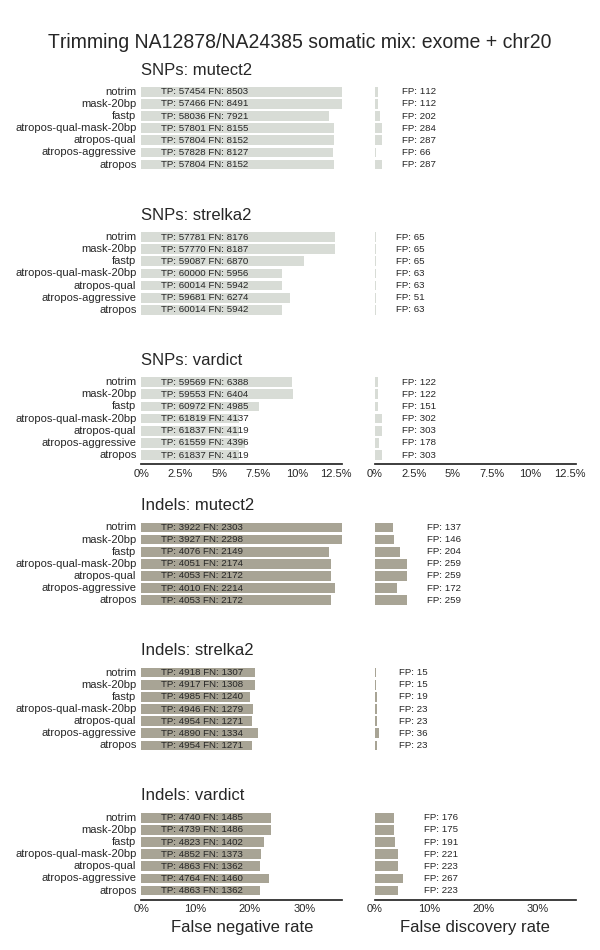

## Read trimming

Explore impact of 3' read trimming on run times and quality performance for 
[a sequenced mixture dataset of two Genome in a Bottle samples](ftp://ftp-trace.ncbi.nlm.nih.gov/giab/ftp/use_cases/mixtures/UMCUTRECHT_NA12878_NA24385_mixture_10052016/)
simulating a lower frequency set of calls. It has a 90x tumor genome consisting of 30% NA12878
(tumor) and 70% NA24385 (germline) and a 30x normal genome of NA24385. Unique
NA12878 variants are somatic variations at 15% and 30%.

This sample has slow runtimes with many callers, potentially due to read quality
issues. Inspired by [DNAnexus' work examining problematic reads with Readshift](https://blog.dnanexus.com/2018-01-16-evaluating-the-performance-of-ngs-pipelines-on-noisy-wgs-data/)
we looked at the impact of 3' quality trimming on runtimes. We also added polyG
trimming to avoid G errors at the end of NovaSeq reads, and polyX trimming to
remove other low complexity regions that contribute to slow alignment and
variant calling times.

Two different trimming methods [atropos](https://github.com/jdidion/atropos)
and [fastp](https://github.com/OpenGene/fastp) had different impacts on read
calls and runtimes. atropos improved runtimes for both alignment and variant
calling, while fastp runtimes were about identical to untrimmed. We tuned fastp
to be more aggressive in trimming low quality 3' ends without much change in
runtimes, suggesting the difference is due to polyX trimming but are still
investigating.

### Quality changes

Both atropos and fastp improve sensitivity of detection:

### Post-trimming Runtime changes

- minimap2 alignment -- for atropos trimming runtimes 
  are 75-80% of the original non-trimmed runs variant calling, while fastp are
  the same: untrimmed (1:10), atropos (0:53), fastp (1:07)

- Variant calling runtimes for the worst case region (chr20 full region)

atropos improves runtimes quite dramatically, especially for callers like
MuTect2 that struggled with slow runs on this data. fastp has a much smaller
improvement in runtime. Our next task is to explore the trimming differences
that contribute to this.

caller   | untrimmed | atropos | fastp |
--- | --- | --- | --- |
vardict  |  1:46 |  1:08 65% |  1:25 80% |
mutect2  |  5:59 |  2:38 44% |  5:03 84% |
strelka2 |  0:36 |  0:28 78% |  0:32 89% |

### Trimming runtimes

For a 24Gb BAM file fastp is ~3x faster than atropos: 

- atropos 3:50
- fastp 1:20
